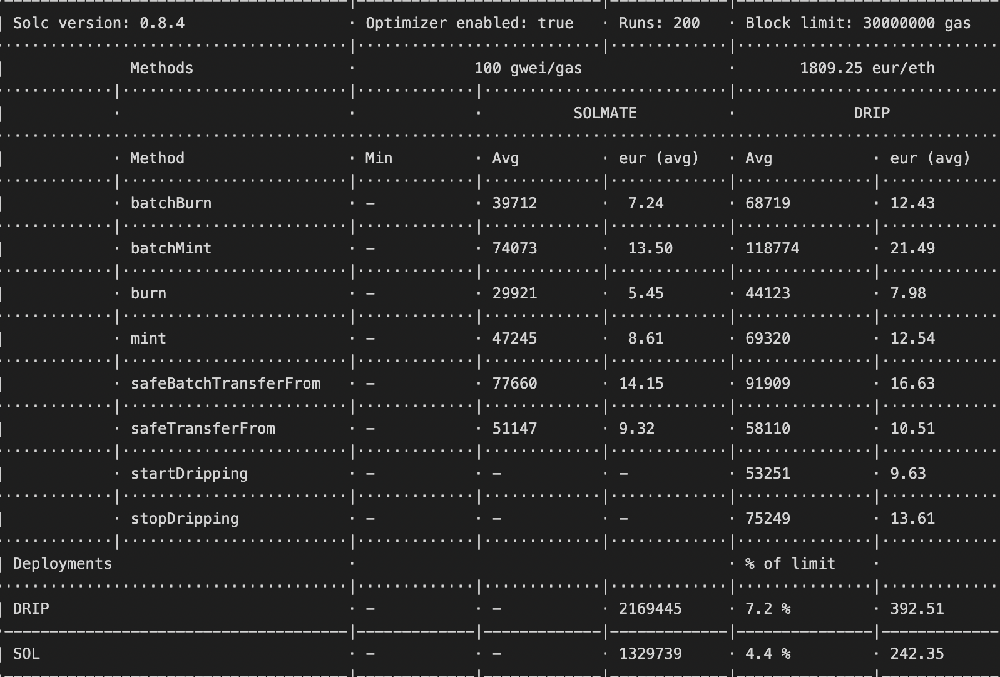

## DRIP1155

This is an ERC1155 implementation that supports token dripping(streaming) for a predefined number of IDs, while still allowing for fungible and non-fungible token implementations. Rather than wallets claiming tokens, tokens will drip into desired wallets at an emission rate accrued per block.

TLDR; Calculates a wallet's balance based on emission rate and the block num a wallet starts accruing at. Token balances of accuring wallets will increase every block. Regular fungible and non-fungible tokens are still implementable.

### Contracts

DRIP1155.sol - ERC1155 implementation that supports dripping.

Must define dripIdLimit which determines what IDs are drippable. If dripIdLimit is 2, IDs 0 and 1 can be dripped, while any further IDs can be used either as regular fungible or nonfungible tokens depending on implementation. dripIdLimit is immutable after initialization.

Must define emissionRatePerBlock for each drippable token, which determines how many tokens will be dripped into each wallet per block. This value is immutable after initialization.

\_startDripping(address, multiplier) and \_stopDripping(address, , multiplier) increase and decrease a wallets emissions respectively.

### Example Use Cases

DRIP1155.sol was inspired by the DRIP20 implementations and was initially designed for a dungeon crawler game that has multiple different fungible tokens.

### Gas usage

Solmate ERC1155 vs DRIP1155

### Security

This is an experimental implementation of ERC1155 and has not received a professional audit. I promise no security guarantees and will not be liable for any issues.

### Testing and Usage

Using Hardhat. Main tests found in local-tests.js, the gas cost comparison tests are found in gas-tests-solmate.js and gas-tests.js for the Solmate and DRIP1155 implementations respectively.

### Caveats

The same as for [0xBeans DRIP20 implementation](https://github.com/0xBeans/DRIP20)

### Shoutouts

T11s and Solmate for the slim ERC1155 implementation. 0xBeans for the DRIP20 and GIGADRIP20 contracts on which this implementation is based on.
